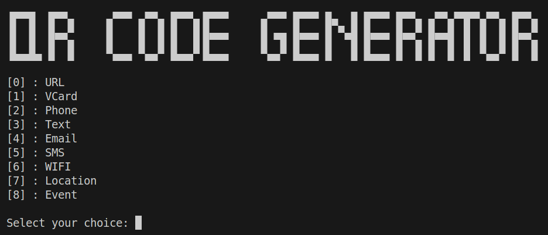
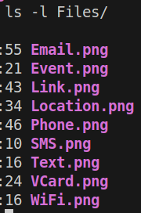

This program is written in Go and can generate QR Code for various purposes.

URL, VCard, Phone, Text, Email, SMS, WIFI, Location, Event

The QR Codes are generated inside the Files Folder.

Install go-qrcode

```shell
go get -u github.com/skip2/go-qrcode
```

Clone the repository and run the program

```shell
git clone https://github.com/mariosdaskalas/goqrcode && cd goqrcode && go run .
```

You need Go installed in your system to be able to run this program

```shell
go version go1.24.1 linux/amd64
```



